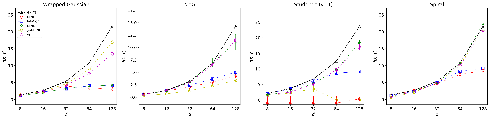

<h1 align="center"> Mutual Information Estimation with Vector Copulas</h1>

<p align="center">
  <b>Vector Copula Estimator (VCE) — an MI estimator disentangling marginal patterns from dependence structure</b>
</p>

<p align="center">
  
  
  
  
</p>

---

## ✨ Highlights

- **Disentangles marginals and dependence** — isolates marginal effects from the
  dependence structure (i.e., the vector copula), then learns and models the two separately.
- **Test-time search of the optimal copula** — train *N* candidate copulas jointly, then search for
  their best combination at test time, with no retraining. Fast, accurate dependence characterization.
- **6 estimators in one interface** — all share `learn(x, y)` / `MI(x, y)`.
- **7 benchmarks with ground-truth MI** — heavy-tailed, nonlinear, manifold, and image data.
- **Self-contained & lightweight** — pure PyTorch with NumPy/SciPy; no external libraries required.

## 🚀 Installation

**Requirements:** Python ≥ 3.9, PyTorch ≥ 2.0, CUDA strongly recommended.

```bash
pip install -r requirements.txt
```

## ⚡ Quick Start

```python
import torch
from datasets import Spiral
from estimators import VCE

device = "cuda" if torch.cuda.is_available() else "cpu"

# A benchmark with closed-form MI. X, Y are each (n, dim//2); dim_x == dim_y.
dataset = Spiral(rho=0.7, dim=64, v=3.14 / 2)
X, Y = dataset.sample(n=10000)
X, Y = X.to(device).clone().detach(), Y.to(device).clone().detach()

class Hyperparams(object):
    def __init__(self):
        self.lr = 5e-4
        self.bs = 500
        self.wd = 1e-5
        self.max_iteration = 1250

estimator = VCE(Hyperparams())              
estimator.to(device)
estimator.learn(X, Y)
print("true MI:", dataset.MI())
print("est MI:", estimator.MI(X, Y))
```

The same setup runs in [`exp_spiral.ipynb`](exp_spiral.ipynb).

## 🗜️ High-Dimensional Data

Like any generative estimator, VCE degrades when the per-side dimension is very large. For
high-dimensional inputs such as **images** or **LLM embeddings**, we recommend compressing each side
to a low-dimensional latent first — with an **autoencoder** or **PCA** — and estimating MI on the latent. The
`compression/` module provides this:

```python
from compression import Autoencoder

k = 32                                            # target latent size (same for both sides)

# train a reconstruction, then encode each side independently
ae_x = Autoencoder(x_dim=X.size(1), latent_dim=k).to(device); ae_x.learn(X)
ae_y = Autoencoder(x_dim=Y.size(1), latent_dim=k).to(device); ae_y.learn(Y)
Zx, Zy = ae_x.encode(X), ae_y.encode(Y)           # each (n, k)
print(ae_x.compressibility(X))                    # recon score in ~[0, 1]; ≈1 = near-lossless
print(ae_y.compressibility(Y))                    # recon score in ~[0, 1]; ≈1 = near-lossless

estimator.learn(Zx, Zy)                           # then estimate MI on the compressed codes
```

As long as the compression is near-lossless (compressibility ≈ 1), MI between the latent tracks the original MI.

## 🧩 Estimators

Every estimator is an `nn.Module` exposing `learn(x, y)` (train) and `MI(x, y)` (read), and trains
through the shared `optimizer.py` (Adam, 80/20 split, early stopping).

| Estimator | Import | Family |
|---|---|---|
| **VCE** *(ours)* | `from estimators import VCE` | vector copula |
| MINE | `from estimators import MINE` | Donsker–Varadhan lower bound |
| InfoNCE | `from estimators import InfoNCE` | contrastive (CPC / NCE) bound |
| MRE | `from estimators import MRE` | MI via (reference-based) ratio estimation |
| MINDE | `from estimators import MINDE` | diffusion / score-based |
| MIENF | `from estimators import MIENF` | MI via pairs of normalizing-flow transformations |

Key VCE parameters (attributes on the `Hyperparams` object):

- `K_components` — copula mixture component count (default 32)
- `n_restarts` — best-of-*N* copula fits, run in parallel (default 4)
- `bon_selection` — whether to run the test-time copula search (default `True`)

## 📊 Benchmarks

All ship with closed-form or exactly-computable ground-truth MI, adapted from [1, 2]. Each comes with a self-contained
notebook that samples the data, runs the estimators, and reports MI against ground truth.

| Benchmark | What it probes | Example |
|---|---|---|
| Wrapped Gaussian | non-Gaussianity | [`exp_wrapped_gaussian.ipynb`](exp_wrapped_gaussian.ipynb) |
| Multivariate Student-t | heavy-tailed dependence | [`exp_student_t.ipynb`](exp_student_t.ipynb) |
| Mixture of Gaussians | multimodal dependence | [`exp_mog.ipynb`](exp_mog.ipynb) |
| Smoothed uniform | non-Gaussian dependence | [`exp_smoothed_uniform.ipynb`](exp_smoothed_uniform.ipynb) |
| Swiss Roll | manifold structure | Coming soon |
| Spiral | highly transformed data | [`exp_spiral.ipynb`](exp_spiral.ipynb) |
| Images with known MI | high-dimensional image | [`exp_image_gaussian_plot.ipynb`](exp_image_gaussian_plot.ipynb) |
| Qwen IMDB embeddings | language model embeddings | Coming soon |

[1] Czyż et al. [Beyond Normal: On the Evaluation of Mutual Information Estimators](https://arxiv.org/abs/2306.11078). NeurIPS 2023. 

[2] Butakov et al. [Information Bottleneck Analysis of Deep Neural Networks via Lossy Compression](https://arxiv.org/abs/2305.08013). ICLR 2024. 

## 📈 Performance Overview

**Estimation accuracy across four benchmarks**



**Mean training time per estimator (seconds)**

<table width="100%" style="width:100%; table-layout:fixed;">
  <tr>
    <th align="center">MINE</th>
    <th align="center">InfoNCE</th>
    <th align="center">MINDE</th>
    <th align="center">MIENF</th>
    <th align="center">VCE (ours)</th>
  </tr>
  <tr>
    <td align="center">184s</td>
    <td align="center">752s</td>
    <td align="center">157s</td>
    <td align="center">567s</td>
    <td align="center">291s</td>
  </tr>
</table>

You can reproduce using `python run_bench.py`. VCE is not always the best, but is accurate (average #1) and efficient (average #3).

## 📁 Project Structure

```
estimators/     MI estimators (VCE + 5 baselines), shared learn(x,y) / MI(x,y) interface
nde/            neural density estimators — flows (NAF, MAF, FM), copulas (VGC) and MoG. 
datasets/       synthetic & image benchmarks with known ground-truth MI
compression/    autoencoder & PCA to compress high-dim inputs (images, embeddings) before MI
optimizer.py    shared training loop (Adam, train/val split, early stopping control)
exp_*.ipynb     one self-contained experiment notebook per benchmark
```

## 📖 Citation

If you find the code and method useful, please consider citing our NeurIPS paper:

```bibtex
@article{chen2025neural,
  title={Neural mutual information estimation with vector copulas},
  author={Chen, Yanzhi and Ou, Zijing and Weller, Adrian and Gutmann, Michael},
  journal={Advances in Neural Information Processing Systems},
  volume={38},
  pages={44803--44823},
  year={2025}
}
```
